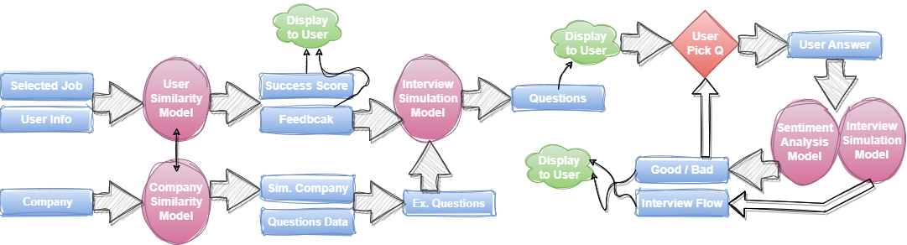
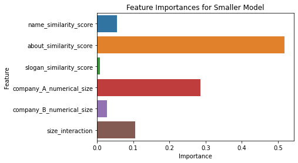
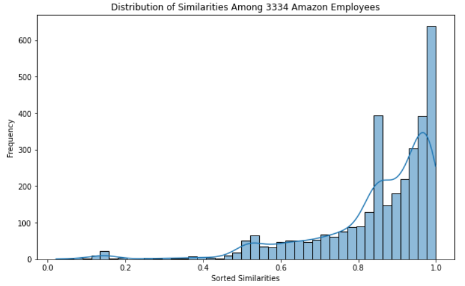

# LinkedIn Dream Job Scorer

This project was implemented as part of a "Data Gathering and Managing" Lab course, Technion. Our product is added to a position page in LinkedIn, and offers the user unique, personalized insights as well as interview practice.

### Team Members
- [Renana Shahak](renanas@campus.technion.ac.il)
- [Gili Cohen](gili.cohen@campus.technion.ac.il)
- [Naomi Derel](naomi.derel@campus.technion.ac.il)

## Contents

1. [Introduction](#introduction)
2. [Data Gathering](#data-gathering)
3. [Models](#models)
    - [Company Similarity Model](#company-similarity-model)
    - [User Success Score Model](#user-success-score-model)
    - [Interview Practice Model](#interview-practice-model)
4. [Simulation Example](#simulation-example)

## Introduction

This repository contains a 'proof of concept' for the LinkedIn Dream Job Scorer, with the code necessary to recreate our data-scraping, our analysis and the different ML models we implemented. 

**Pipeline of our product functionality:**

<div style="background-color:white; width:70%; padding:10px; border-radius:10px; align:center">
    
</div>
<p>

## Data Gathering

Our project is dependent on exclusive LinkedIn datasets by BrightData. They contain 'companies' and 'profiles' data scraped from appropriate LinkedIn pages. 

Additional data is included in the 'data' folder, contains the following files.


## Models

### Company Similarity Model

Relevant code is available in the file `company_similarity_model.ipynb`. 

To conduct a similarity analysis, we used the ‘similar’ property in the data as our positive labels and additionally sampled a negative selection of companies. We used this data to train a Random Forest model which predicts our binary similarity label. During inference, we combine the company we want to enrich the data for with our sample of informative companies, and find the closest one. 

For this algorithm, we suggested the following features grounded in our domain knowledge: 
- NLP similarity features: comparing the tf-idf vectors with cosine similarity. We used this method on the name, ‘about’ description, and slogan of the company.
- Binary comparison (identical or not) between the industries and meta-industries of the companies, as they are nominal values and cannot be numerically compared. 
- Numerical features such as the number of locations and the company's size as numerical values.  
- Interaction feature between the sizes of the companies, to enhance the effect. 

After feature importance analysis, we retained only the features related to the name, 'about' section, and slogan, given the pivotal role of NLP analysis, along with the numerical size feature, which proved to be impactful.

<div style="background-color:white; width:70%; padding:10px; border-radius:10px; align:center">
    
</div>
<p>

The trained model is available only through our databricks, under the following path:

`/FileStore/shared_uploads/naomi.derel@campus.technion.ac.il/companies_model/rf_companies_similarity`

### User Success Score Model

To create similarities scores between users and company employees, we used Cosine Similarity. We extracted feature vectors from the profiles data for each user, and grouped them by their current companies. Then, for each company, we calculated the cosine similarity between each employee’s feature vector and the average feature vector of the rest of the employees in the company. To obtain a similarity score between a new user and the employees in the company she is inquiring about, we calculated the cosine similarity between her feature vector and the company employees’ average feature vector, and returned her relative rank as a probability to succeed in the interview. 

Example of similarities distribution - 

<div style="background-color:white; width:70%; padding:10px; border-radius:10px; align:center">
    
</div>
<p>

If the company the user is interested in is deemed too small, we give her a weighted rank of her relative similarity to that company’s employees and to an additional similar company’s employees. This is important as many companies have less than THRESHOLD employees, and we believe such a small sample might be sensitive to outliers, mistakes and sampling bias.


### Interview Practice Model

*Note: This model incorporates the use of Gemini, therefore requires a personal API key, which will be removed after the project is graded for security reasons.*

Relevant code is available in the file `interview_practice_model.ipynb`.

Using the information gathered by the previous models, a "pre-interview" scenario is crafted, allowing the user to practice effectively for the real interview. Customized questions that align with the job's requirements, the company values, and the user's personal achievements are generated and available for a simulation of the interview. Upon selecting a question to simulate the interview process for, the user's answer is processed both by Gemini for a realistic simulation, and by our own sentiment analysis model, which evaluates the response as professional and confident, or lacking and with room to improve. Then the process is repeated for as many questions as the user desires. 

## Simulation Example

In order to run the entire product, the 'User_Similarity_Model', 'Company_Similarity_Model', and 'Sentiment_Analysis_Model' notebooks must be ran to create all the models and necessary data. Alternatively, they can be accessed through the paths in the code for those who have permission. Then, it is possible to run the 'Example' notebook, and replace the random sampling with the information about the desired user and company. We will simulate an example of the stages of the product -

1. A new user is inquiring about a specific job posting.


   ```bash
    job_posting = company_features_jobs.orderBy(rand(seed=2)).limit(1)
    company_name = job_posting.select('name').collect()[0][0]
    job_name = job_posting.select('job').collect()[0][0]

    print("company:", company_name)
    print("job:", job_name)
    print("Number of employees in the company:", job_posting.select('num_emp').collect()[0][0])
   ```
**Output**

company: northwestern mutual

job: Recruiter

Number of employees in the company: 576


   ```bash
    user = user_feature_vectors.orderBy(rand(seed=22)).limit(1)
    user_features = user.select('features').collect()[0][0].toArray().tolist()
    user_id = user.select('id').collect()[0][0]

    print("User ID:", user_id)
    print("User features:")
    for i in range(len(user_features)):
        print(f"{ordered_features[i]}: {user_features[i]}")
   ```
**Output**

User ID: susan-chon-b32638123

User features:

years of education: 11.0
years of experience: 14.666666666666666
recommendations: 0.0
volunteer experience: 0.0
english: 1.0
spanish: 0.0
.
.
.
hebrew: 0.0
high school diploma: 1.0
associate's degree: 1.0
bachelor's degree: 1.0
master's degree: 1.0
doctorate's degree: 1.0

2. The model supplies initial feedback

   ```bash
    msg, msg_dict = get_info(user_features, company_name)
    Markdown(msg)
   ```
**Output**

Your perliminary calculated chances of suitability for this job are 63.2%.

You have matched or exceeded the recommended amount of years of education, years of experience for this job. The recommended education level is a bachelor's degree, which you achieved.

You have 1 less recommendations than recommended for this job.

3. The interview simulation environment is created

    ```bash
    initial_prompt = f"Pretend you are an interviewer at {company_name}. Ask me some questions in a job interview for a {job_name} position. Output the questions as a list."

    if user_analysis is not None:
        initial_prompt += f"\nAsk me some questions specifically about my strengths: {user_analysis['good']}, and weaknesses: {user_analysis['bad']}."

    if len(similar_questions) > 0:
        initial_prompt += f"\nHere are some example questions from similar companies:\n{similar_questions}"
    else:
        initial_prompt += f"\nHere are some examples for interview questions:\n{example_questions}"

    # initial_prompt:
    response = gemini_model.generate_content(initial_prompt)

    # generate answers:
    to_markdown(response.text)    
    ```

**Output**

Strengths Questions:

Describe a time when you successfully exceeded expectations in a recruiting role and the impact it had on your organization.
How have your previous experiences prepared you for the high-volume recruiting environment at Northwestern Mutual?
What are your strengths that you believe would make you a valuable asset to our team?
Weakness Questions:

You have one less recommendation than recommended for this job. How do you plan to address this potential shortcoming?
What specific areas do you believe you need to improve in order to meet the expectations of this role?
Additional Questions:

How do you stay up-to-date on industry best practices and trends in recruiting?
What strategies do you use to identify and attract top-tier candidates?
How do you handle the challenges of managing multiple recruiting pipelines simultaneously?
How do you assess the fit between a candidate and a specific position?
What is your approach to building and maintaining relationships with hiring managers and stakeholders?
How do you evaluate the success of your recruiting efforts?
What is your understanding of Northwestern Mutual's culture and values?
Why are you interested in working for Northwestern Mutual specifically?
What are your long-term career aspirations and how does this role align with them?

4. A question is chosen, and an answer is given by the user. The answer is processed by the interview environment and the sentiment analysis model

    ```bash
        # assume that the user clicked a question to answer:
    question_picked = "Describe a time when you successfully exceeded expectations in a recruiting role and the impact it had on your organization."

    interview_prompt_instruction = f"Pretend you are an interviewer, and you asked me the question: {question_picked}. Respond to my answer and give me an evaluation about my answer: "

    bad_user_input = "Yeah, so there was this one time when I was doing recruiting stuff, and, like, we needed to hire some people real quick because, you know, we had a lot of work piling up and not enough hands to do it. So, I kinda just did what I usually do, like posting job ads online and stuff. I didn't really have a plan or anything, just kinda winged it. Anyway, we managed to hire a few folks eventually, but it took longer than expected, and we had to settle for some candidates who weren't exactly what we were looking for. It was kind of a mess, to be honest, and it didn't really have much of an impact on the organization. We got the work done eventually, but it wasn't anything to write home about."

    response = gemini_model.generate_content(interview_prompt_instruction + user_input)
    to_markdown(response.text)
    ```
**Output**

Evaluation:

Your answer effectively addresses the question by highlighting your commitment to innovation and forward-thinking. You provide specific examples of how you have exceeded expectations in your recruiting role and the impact it has had on your organization.

Response:

"Thank you for sharing your experience of successfully exceeding expectations in your recruiting role. Your commitment to innovation and forward-thinking is evident in your accomplishments, and I believe you would be a valuable asset to our team at Amazon.

Your ability to identify and recruit top talent, coupled with your understanding of emerging trends and technologies, aligns perfectly with our company's ethos as pioneers. Your proactive approach and dedication to driving transformative impact would make you an exceptional addition to our team.

I am particularly impressed with your leadership in developing and implementing cutting-edge technologies and spearheading initiatives to optimize operational efficiency. Your ability to think strategically and drive change aligns with our company's culture of innovation and growth.

I am confident that your skills and experience would enable you to make a significant contribution to Amazon. Your passion for exploration and dedication to excellence are qualities that we highly value in our team members.

Thank you again for sharing your experience. We would like to invite you to the next round of interviews to further explore your qualifications and how you can bring your innovative mindset to our organization."

    ```bash
    prob_bad, prob_good = inference_of_answer(loaded_model, bad_user_input)

    print(f"Good: {prob_good}, Bad: {prob_bad}")
    print("Decision: " + "Good" if prob_good > prob_bad else "Decision: " + "Bad")
    ```
**Output**

Good: 6.348652095766738e-05, Bad: 0.9999364614486694

Decision: Bad


The user than chooses the next question.
